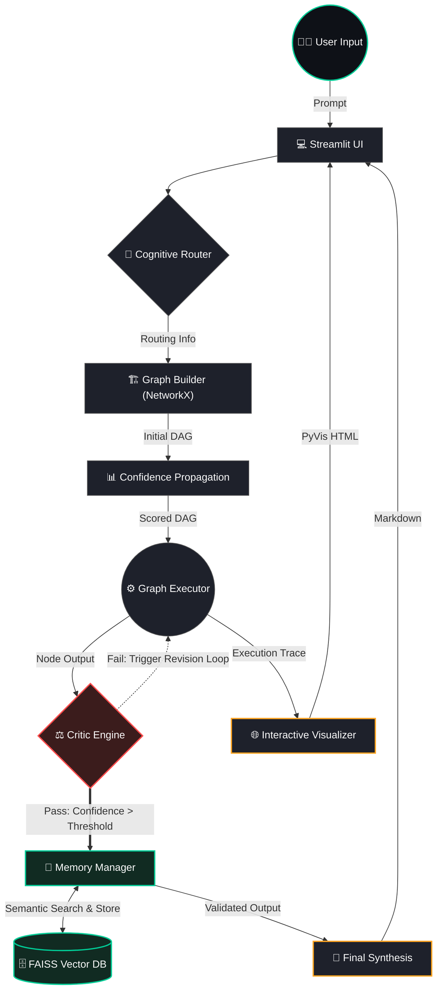

# 🧠 ThirdEYE V1


An advanced, self-correcting autonomous AI agent built with a Directed Acyclic Graph (DAG) reasoning architecture. It features dynamic routing, a rigorous self-evaluating Critic loop, semantic long-term memory, and a live interactive web UI.

---

## ✨ Key Features

* **Dynamic Cognitive Routing:** Analyzes incoming queries to determine complexity, uncertainty, and the optimal LLM to handle the task.
* **Self-Healing DAG Planner:** Maps out a multi-step execution topology. If a step fails, the integrated **Critic Engine** automatically triggers a targeted revision loop until a confidence threshold (e.g., >90%) is met.
* **Semantic Long-Term Memory:** Uses `sentence-transformers` and `FAISS` to semantically index successful pipeline executions, allowing the agent to "remember" past solutions and avoid repeating mistakes.
* **Live Interactive Visualizer:** Renders the agent's internal thought process and topological execution path in real-time using `PyVis`. Revision nodes are visually clustered with dotted paths and color-coded by confidence scores.
* **Safe & Optimized Execution:** Includes token truncation guards, infinite-loop breakers, and aggressive constraint prompting to ensure fast, lean inference.

---

---

## 💻 Tech Stack

* **Frontend:** [Streamlit](https://streamlit.io/) (with custom CSS injection & dark mode)
* **Graph Visualization:** [PyVis](https://pyvis.network/) (Hierarchical HTML physics engine)
* **Graph Mathematics:** [NetworkX](https://networkx.org/)
* **Vector Memory:** [FAISS](https://github.com/facebookresearch/faiss) (CPU) + HuggingFace `all-MiniLM-L6-v2`
* **LLM Engine:** Groq / OpenAI / Anthropic (Configurable via Environment Variables)

---

## 🚀 Local Installation & Setup

### 1. Clone the repository
```bash
git clone https://github.com/Jagpaljhala21/ThirdEye.git
cd ThirdEye
